# 科技项目管理系统操作流程说明（截图版）

生成时间：2026-07-02

## 1. 基础账号

| 角色 | 登录账号 | 密码 | 主要入口 |
| --- | --- | --- | --- |
| 单位用户 | `e2e_20260630_103223_unit` | `Test@2026pass` | 项目申报、验收管理、全周期管理 |
| 区县审核 | `e2e_20260630_103223_county` | `Test@2026pass` | 审核任务、验收管理 |
| 部门审核 | `e2e_20260630_103223_department` | `Test@2026pass` | 审核任务、验收管理 |
| 专家评审 | `e2e_20260630_103223_expert` | `Test@2026pass` | 审核任务、验收管理 |
| 管理员 | `e2e_20260702_delivery_admin` | `Test@2026pass` | 单位管理、账号管理、申报批次、验收管理 |
| 超级管理员 | `admin` | `ChangeMe-2026` | 首页管理、安全中心、系统配置、数据字典、系统文案 |

## 2. 项目类别、项目类型、预算金额

项目类别和项目类型有两层配置：

| 配置位置 | 作用 |
| --- | --- |
| 数据字典 | 维护全局候选项，例如 `project_category`、`project_type`。入口：超级管理员/管理员登录后进入“数据字典”。 |
| 申报批次 | 限制当前批次允许申报的类别和类型。入口：管理员/超级管理员进入“申报批次”，编辑批次里的“允许项目类别”“允许项目类型”。留空表示不限。 |

申报项目时，如果批次设置了允许范围，表单只显示该批次允许的类别/类型；如果批次未限制，则显示数据字典里的候选项。

项目申报表单中的预算金额单位为“万元”，例如填写 `50.00` 表示人民币 50 万元；系统保存和部分导出字段仍按“元”存储，用于兼容历史数据和财务统计。

## 3. 单位用户申报流程

1. 打开首页，输入账号、密码和验证码登录。
2. 进入“项目申报”。
3. 点击“新建项目”。
4. 选择申报批次、项目类型、项目类别，填写摘要和预算金额（万元）。
5. 点击“保存草稿”。
6. 在项目列表中打开“更多 -> 附件”，上传申报材料。
7. 附件准备完成后，点击“更多 -> 提交”，项目进入区县审核。

截图：

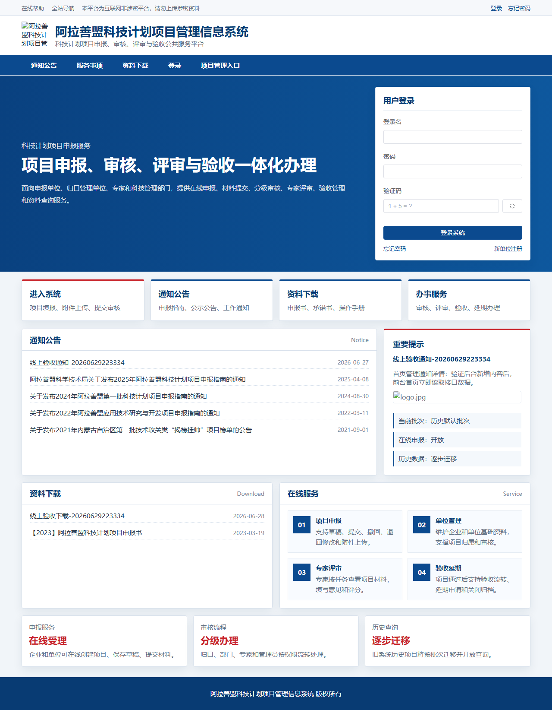

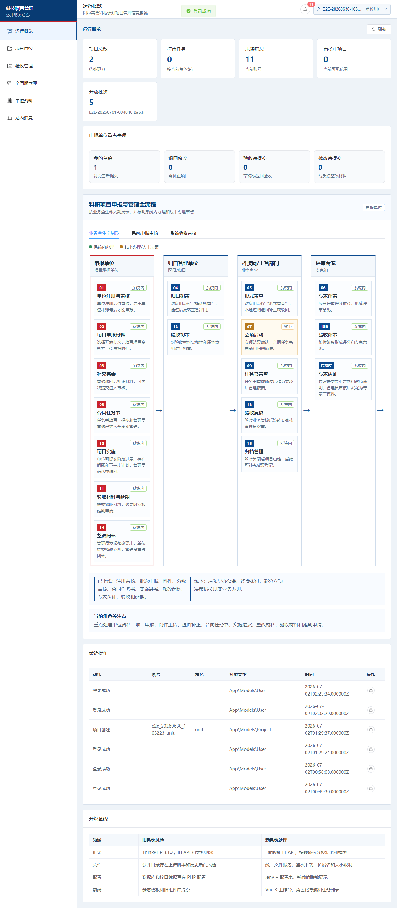

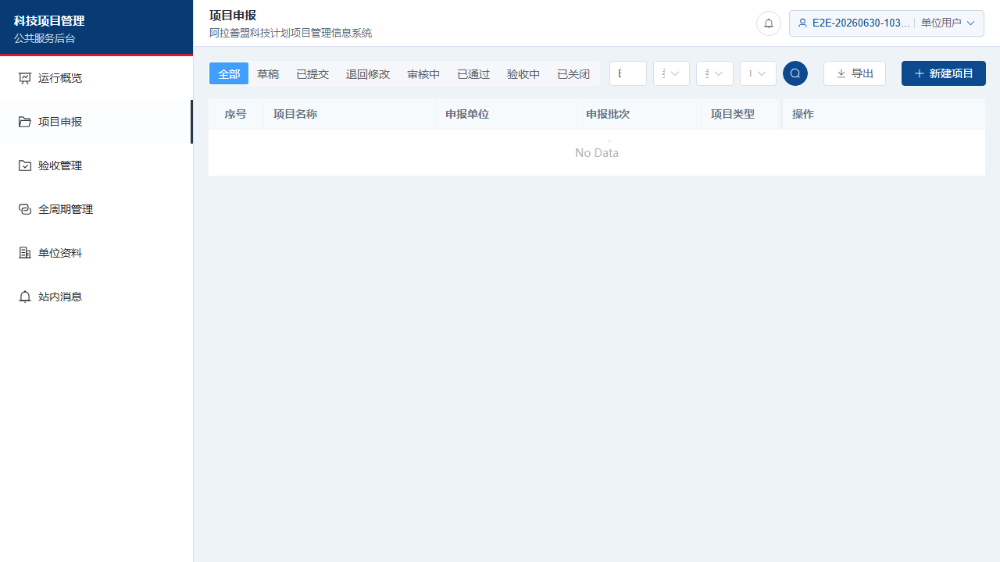

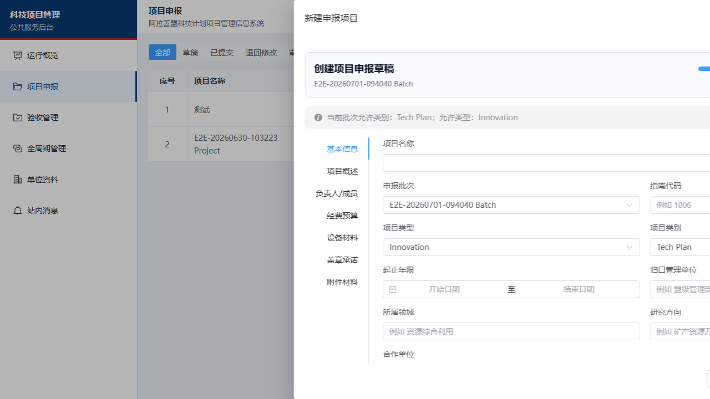

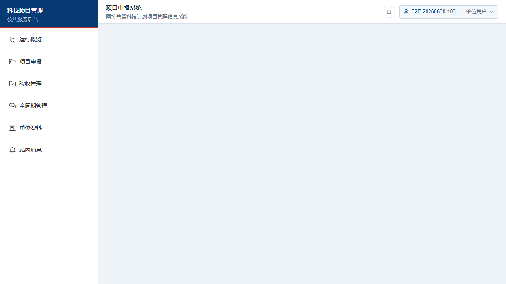

## 4. 区县审核流程

1. 区县账号登录。
2. 进入“审核任务”。
3. 在“待审核”页签查看当前阶段项目。
4. 点击操作列“审核处理”按钮。
5. 选择审核结果，填写评分和审核意见。
6. 点击“提交审核”。通过后流转到部门审核；退回后回到单位修改；驳回后项目结束。

截图：

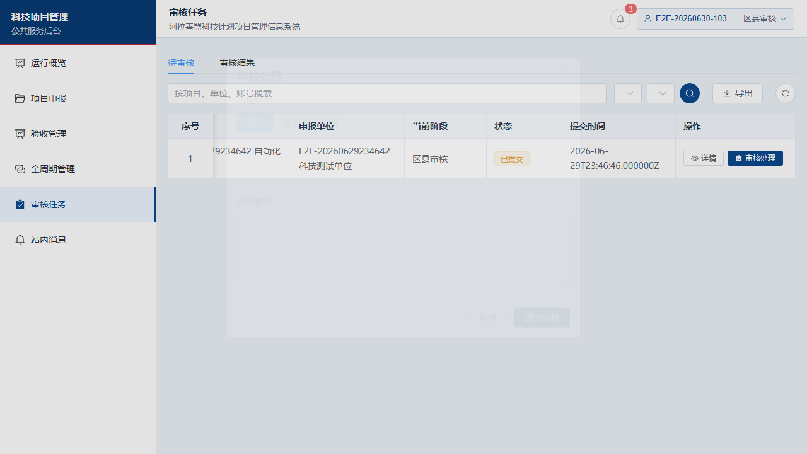

## 5. 部门审核流程

1. 部门账号登录。
2. 进入“审核任务”。
3. 当前有部门待审项目时，在“待审核”页签处理。
4. 已处理项目可在“审核结果”页签查看。
5. 部门通过后，项目流转到专家评审。

截图：

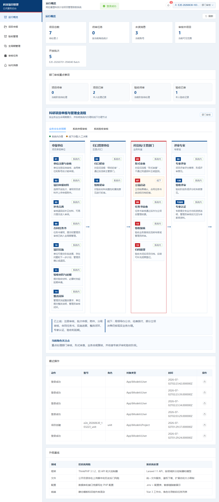

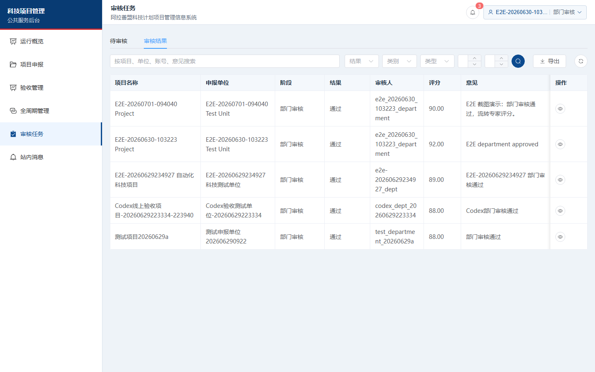

## 6. 专家评分流程

专家评分入口在“审核任务”，不是“全周期管理”。
专家评分项由超级管理员/管理员在“数据字典”维护，分组为 `expert_review_criterion`；每个评分项可维护“评分大类、满分、说明”。系统默认按旧系统评审表内的 17 个得分子项初始化，总分 100 分。

1. 专家账号登录。
2. 进入“审核任务”。
3. 停留在“待审核”页签。
4. 找到当前阶段为“专家评审”的项目。
5. 操作列显示文字按钮：“详情”用于查看材料，“审核处理”用于进入评分/审核弹窗。
6. 点击“审核处理”，弹出“审核处理”。
7. 选择“推荐 / 退回 / 驳回”，按评分大类逐项填写得分，系统自动汇总总分。
8. 点击“提交审核”。推荐后项目流转到管理员终审。

如果专家登录后看不到评分入口，通常是当前没有流转到专家阶段的待审项目。
如果选择“推荐”，系统要求完整填写评分项；如果选择“退回/驳回”，可以只填写审核意见。

截图：

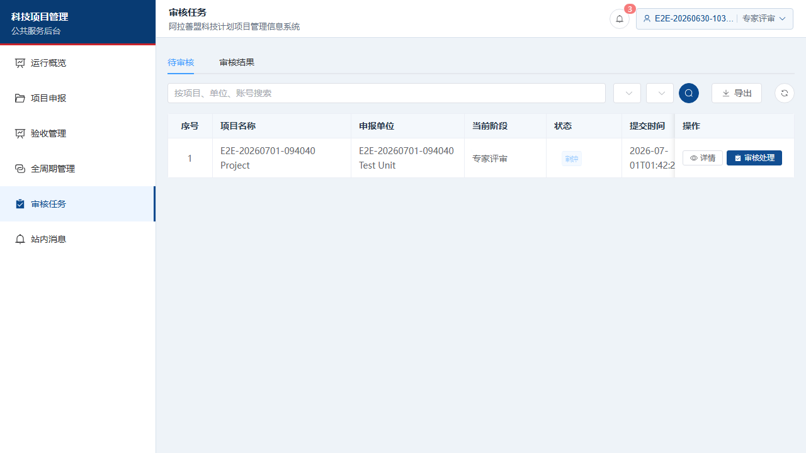

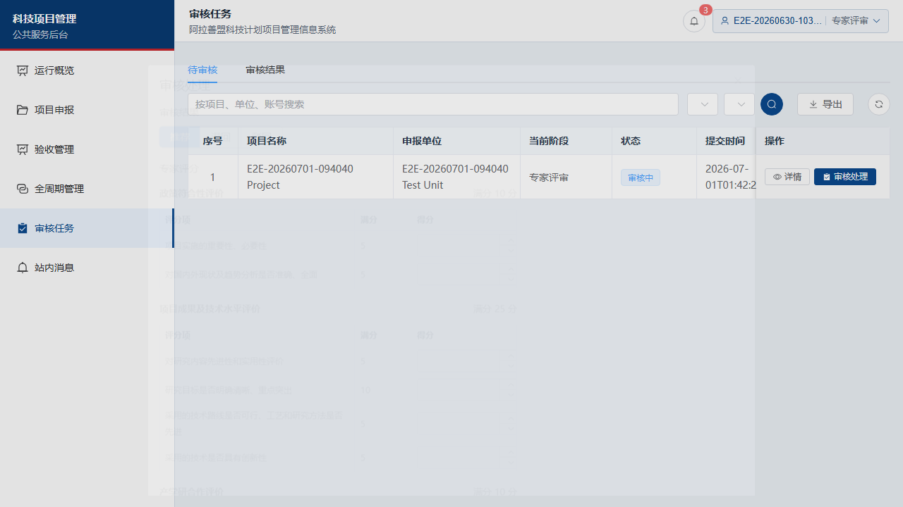

## 7. 管理员与超级管理员常用流程

管理员：

1. “申报批次”：维护开放时间、允许项目类别、允许项目类型、验收必传材料。
2. “账号管理”：维护账号，列表已增加序号，默认按创建时间从早到晚排列。
3. “站内消息”：查看消息，列表已增加序号，默认按时间从早到晚排列。
4. “验收管理”：处理验收、延期、关闭验收。
5. “项目申报”：项目列表已增加序号，默认按创建时间从早到晚排列。

超级管理员：

1. “首页管理 -> 品牌素材”：维护 Logo、Banner、Favicon。
2. “数据字典”：维护项目类别、项目类型等全局选项。
3. “安全中心”：查看登录风控、限流、白名单和安全事件。
4. “系统配置 / 系统文案”：维护系统运行配置和页面文案。

截图：

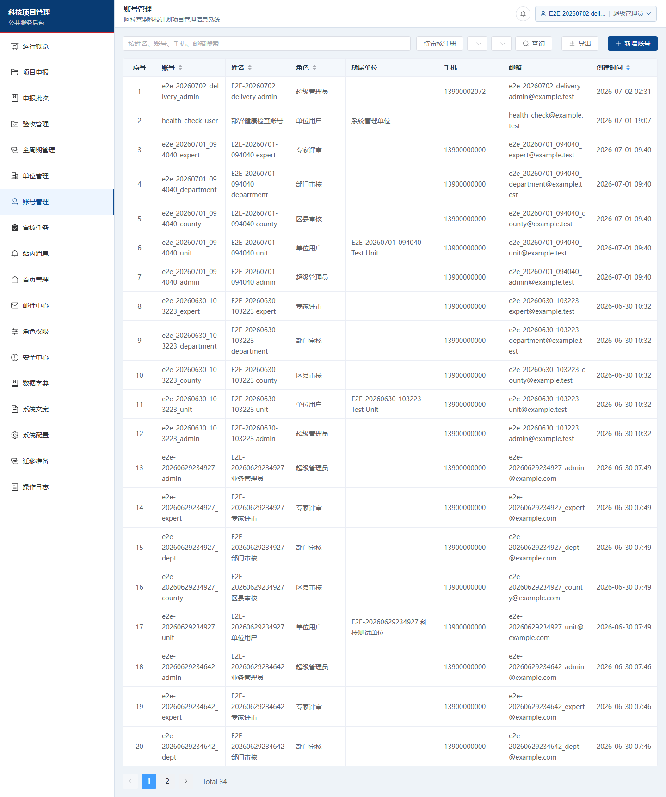

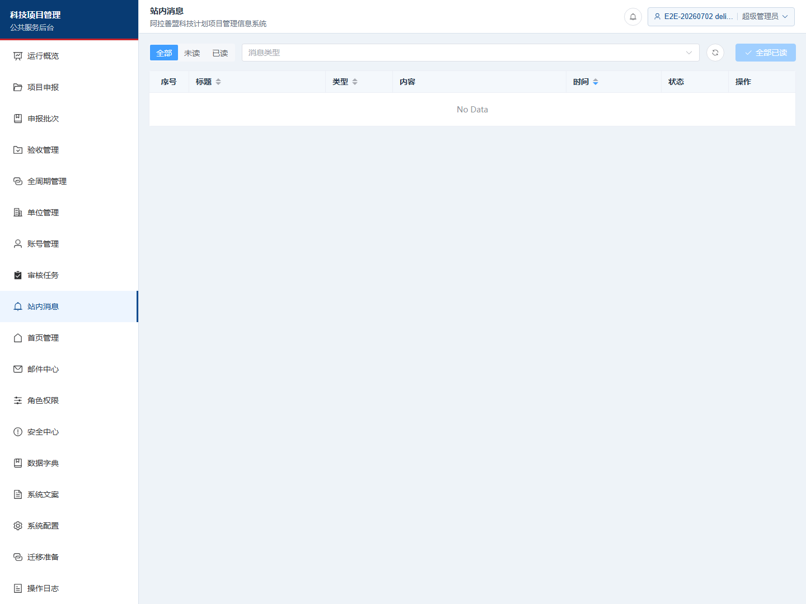

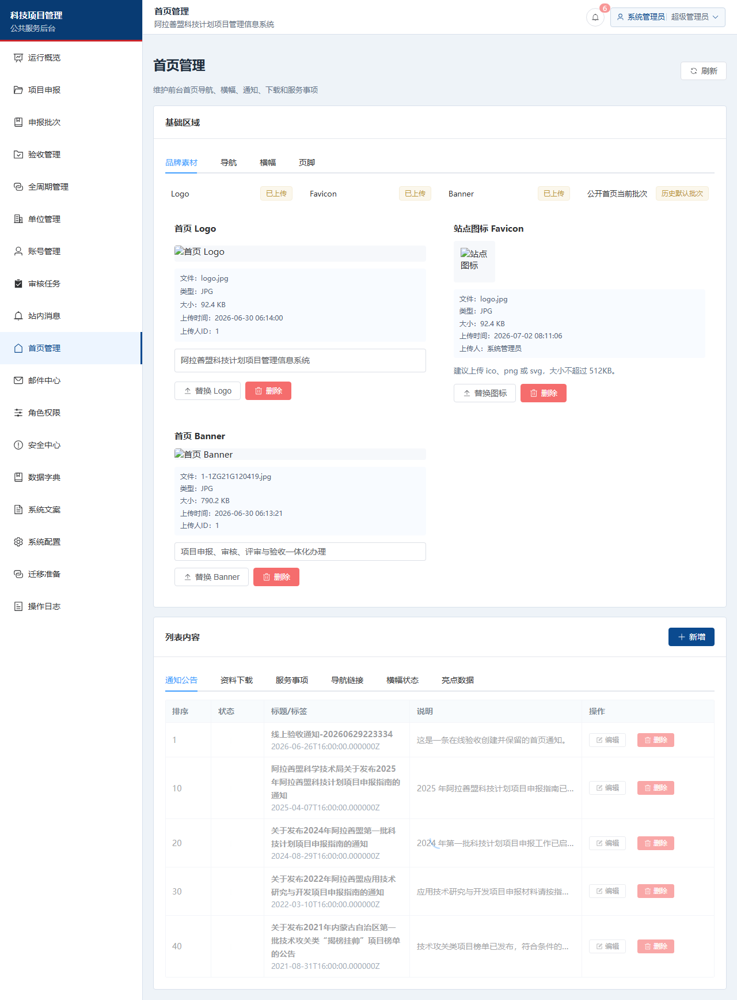

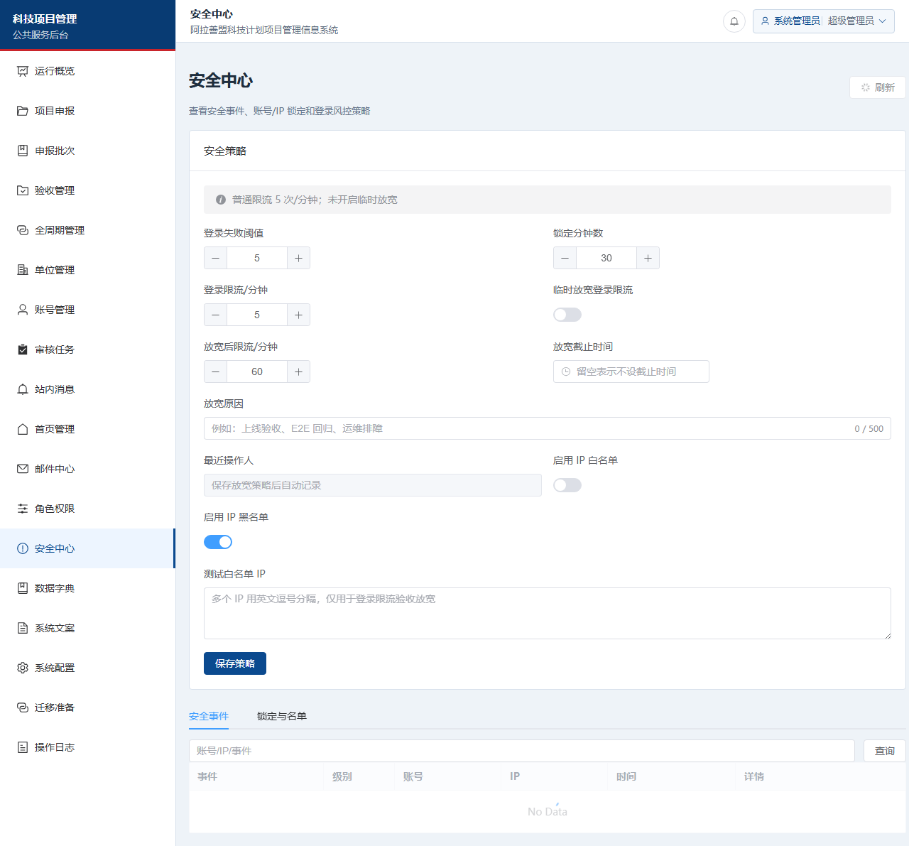

## 8. 本次发现并修复的问题

| 问题 | 原因 | 处理结果 |
| --- | --- | --- |
| 保存草稿看起来没反应 | 后端返回 422，但前端未弹出错误 | 已补充错误提示，保存失败会显示中文原因 |
| 项目类别/类型容易选错 | 表单显示数据字典选项，但批次限制可能是另一套值 | 已改为优先显示当前批次允许范围 |
| 预算金额单位不清楚 | 页面只显示“预算金额” | 已改为前台“预算金额（万元）”录入，并显示“系统保存金额（元）” |
| 账号/消息列表不清楚顺序 | 无序号，默认排序语义不明显 | 已增加序号，默认按时间从早到晚 |
| 专家找不到评分入口 | 评分入口在“审核任务”，不是全周期 | 已将操作按钮改成“详情 / 审核处理”文字按钮，并补截图和说明 |
| 专家评分只有总分 | 新系统此前只保存 `score` 和意见 | 已补“专家评分维度”配置、逐项评分、总分自动汇总、导出展开列 |
